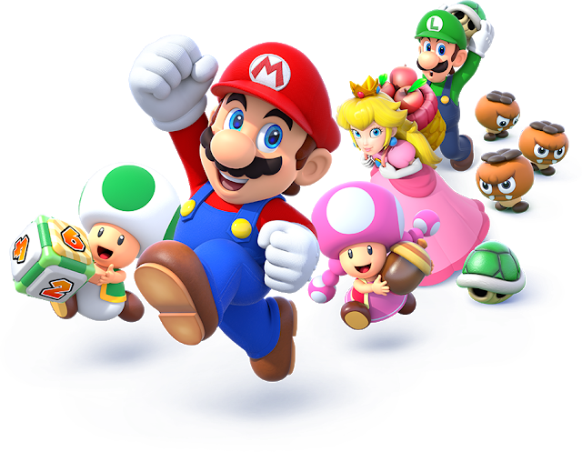

**Videogames Explorer**

  

// **Descripción del Proyecto**
Este proyecto nace como una iniciativa personal para poner en práctica mis conocimientos en desarrollo web, utilizando tecnologías como React, Redux, Node.js, y PostgreSQL. El objetivo es crear una aplicación que permita a los usuarios explorar una amplia base de datos de videojuegos, consultar información detallada sobre ellos, filtrarlos y ordenarlos, así como agregar nuevos videojuegos a la plataforma.

El proyecto se inspiró en mi pasión por los videojuegos y mi deseo de crear algo interactivo y útil. Aprendí mucho durante el proceso, no solo a nivel técnico, sino también en cuanto a la organización del flujo de trabajo y la gestión de un proyecto full-stack.

// **Objetivos**
Construir una aplicación interactiva y dinámica utilizando React, Redux, Node.js y Sequelize para almacenar y gestionar los datos de videojuegos.

Aprender mejores prácticas en el desarrollo de aplicaciones web modernas.

Fortalecer mis habilidades en desarrollo full-stack, abarcando tanto el frontend como el backend.

Practicar el uso de bases de datos SQL con PostgreSQL y la gestión de relaciones de datos complejos.

Implementar un diseño limpio y amigable, aplicando los principios de diseño adquiridos en mi aprendizaje.

// **Funcionalidades**
Búsqueda de videojuegos: Los usuarios pueden buscar videojuegos por nombre utilizando una API externa.

Filtrado y ordenamiento: Se pueden filtrar y ordenar los videojuegos por diferentes criterios, como género y rating, sin depender de las funcionalidades predefinidas de la API.

Creación de nuevos videojuegos: Los usuarios pueden agregar sus propios videojuegos mediante un formulario, incluyendo detalles como nombre, descripción, fecha de lanzamiento, rating y plataformas.

Paginación: Los resultados de búsqueda y los videojuegos de la base de datos se muestran paginados para facilitar la navegación.

// **Tecnologías Utilizadas**
Frontend: React, Redux, CSS

Backend: Node.js, Express, Sequelize, PostgreSQL

Testing: Jest, React Testing Library, Supertest

APIs Externas: RAWG API para obtener datos de videojuegos

// **Instalación y Configuración**
Clonar el repositorio:

git clone https://github.com/IngridBianchi/Videogames-Explorer

Instalar las dependencias:

En el directorio client:

cd client
npm install

En el directorio api:

cd api
npm install

Configurar el archivo .env:

En el directorio api, crea un archivo .env con la siguiente estructura:

DB_USER=tu_usuario_de_postgres
DB_PASSWORD=tu_contraseña_de_postgres
DB_HOST=localhost
API_KEY=tu_api_key_de_rawg

Recuerda obtener tu API Key de RAWG API para poder hacer solicitudes a su API.

Iniciar el servidor:

Para el servidor backend (api):
cd api
npm run dev

Para el frontend (client):
cd client
npm start

// **Estructura del Proyecto**
Frontend
La interfaz de usuario está construida con React y gestionada con Redux. A continuación se detallan las pantallas principales:

Página de inicio: Una landing page atractiva con un botón para ingresar a la página principal.

Ruta principal: Contiene un buscador, filtros por género, opciones de ordenamiento y paginación de videojuegos.

Ruta de detalle de videojuego: Muestra información detallada sobre un videojuego seleccionado, incluyendo imagen, descripción, fecha de lanzamiento, rating y plataformas.

Ruta de creación de videojuego: Permite a los usuarios agregar un nuevo videojuego con información controlada mediante un formulario validado en JavaScript.

Backend
El backend está desarrollado en Node.js con Express y utiliza Sequelize para interactuar con una base de datos PostgreSQL. Los principales endpoints son:

GET /videogames: Obtiene todos los videojuegos disponibles.

GET /videogames?name="...": Busca videojuegos por nombre.

GET /videogame/{id}: Obtiene detalles de un videojuego específico.

POST /videogames: Crea un nuevo videojuego en la base de datos.

// **Mejoras y Funcionalidades Futuras**
Autenticación de usuarios: Agregar un sistema de login y registro para que los usuarios puedan guardar sus videojuegos favoritos.

Interfaz de usuario más refinada: Mejorar el diseño visual y la experiencia del usuario.

Funcionalidades avanzadas de búsqueda: Implementar un sistema de búsqueda más sofisticado con múltiples filtros.

// **Conclusión**
Este proyecto es una de las formas en las que puedo poner en práctica mis habilidades como desarrollador web, abordando tanto el backend como el frontend y aprendiendo nuevas herramientas y técnicas. Además, es un excelente ejemplo de cómo un proyecto personal puede ofrecer mucho aprendizaje y satisfacción personal, mientras se crea algo útil para la comunidad.

// **Agradecimientos**
Gracias a todos los recursos y tutoriales disponibles en la web, y especialmente a la comunidad de open source, por brindarme las herramientas necesarias para llevar a cabo este proyecto.